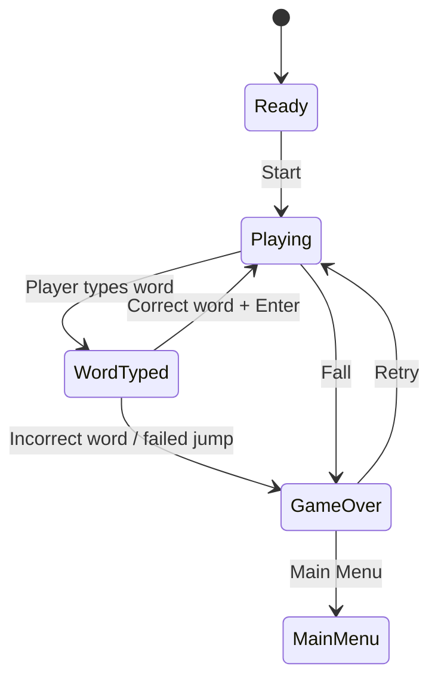
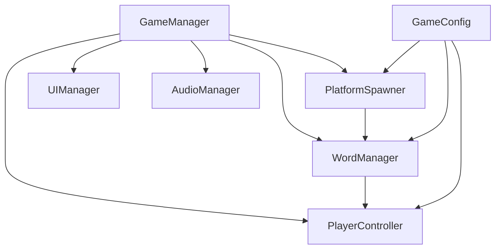

# Game Design Document — Ice Climbers

| | |
|---|---|
| **Working title** | Ice Climbers |
| **Team** | Rom Meir, Daniel Freund |
| **Genre** | Educational / Arcade / Endless Typing-Based Climber |
| **Target platform** | PC (Windows) + Android |
| **Engine / Unity version** | Unity 6 (6000.3.20f1), 2D |
| **Orientation & reference resolution** | Landscape, 960 × 540 reference |
| **Expected session length** | 30 seconds – 5 minutes |
| **Document version** | v0.1 — 2026-09-16 |

---

## 1. High Concept

The player controls an ice climber ascending an endless frozen mountain. Each upcoming ice platform displays a word. The player types the word correctly and confirms it to jump to the next platform. Correct answers continue the climb, while mistakes or failed jumps cause the player to fall. The challenge increases as the player climbs higher.

### Design pillars

1. **Typing drives movement** — Every climb is triggered by correctly typing the displayed word. Features that distract from typing are avoided.
2. **Continuous upward progression** — The game should maintain a fast, uninterrupted climbing rhythm with minimal downtime between platforms.
3. **Speed and accuracy** — Progress depends on typing both quickly and correctly. Difficulty increases gradually through longer words and faster pacing.

---

## 2. Reference & Inspiration

- **Primary reference: Icy Tower** — Taking: vertical platform-to-platform climbing, continuous upward progression, rising difficulty, quick repeatable runs, and score chasing.
- **Main difference:** In our game, movement between platforms is driven by typing the displayed words correctly rather than by direct movement and jump controls.
- **Not taking:** Combat, multiplayer, complex progression systems, or large story elements.

---

## 3. Core Game Loop

### Moment-to-Moment Rules

1. The player starts on the current ice platform.
2. The upcoming platform displays a word.
3. The player types the displayed word using the keyboard.
4. The entered text is validated against the target word.
5. Once the word is correctly entered, the player presses **Enter** to initiate the climb.
6. A successful climb moves the player to the next platform and presents another word.
7. Platforms continue to appear as the player climbs.
8. Difficulty increases as the player climbs higher.
9. An incorrect word or failed jump causes the player to fall.
10. Falling below the playable area ends the run.
- **Scoring:** +1 point is awarded for every successfully reached platform. The high score is stored locally.
- **Failure:** An incorrect confirmed word, failed jump, or fall below the playable area ends the run. The Game Over screen then allows the player to retry or return to the Main Menu.

### Parameters you will need to tune

| Parameter | What it controls | First guess |
|---|---|---|
| `platformSpacing` | Vertical distance between platforms | To be tuned |
| `platformSpeed` | Rate at which new platforms appear/move | To be tuned |
| `wordLength` | Length of words presented | To be tuned |
| `difficultyRamp` | Rate of difficulty increase | To be tuned |
| `wordDisplayTime` | Time available to type a word | To be tuned |
| `playerJumpDuration` | Duration of a climb/jump | To be tuned |
| `maxPlatformDistance` | Maximum reachable platform distance | To be tuned |

**Where these live:** Parameters should be exposed through the game's configuration data so they can be adjusted without rewriting gameplay code.

**Feel target:** A new player should be able to successfully climb several platforms during their first attempts. More experienced players should be able to climb farther through improved typing speed and accuracy.

---

## 4. Controls & Input

| Action | Keyboard / Mouse | Gamepad | Touch |
|---|---|---|---|
| Type Word | Keyboard letters | Not supported | Android on-screen keyboard |
| Confirm / Climb | Enter | Not supported | Confirm / Enter button |
| Retry | Enter / R | Not supported | Retry button |
| Pause | Escape | Not supported | Pause button |
| Menu Selection | Mouse / Enter | Not supported | Touch |

### Input Edge Cases

- Gameplay typing input is disabled while the game is paused.
- Gameplay input is disabled on the Game Over screen except for retry/menu actions.
- Menu input should not accidentally enter characters into the gameplay word field.
- A short input lock can be used during transitions between platforms.
- Invalid or extra characters should not trigger a successful climb.
- On Android, the game uses the on-screen keyboard and touch UI. Typing difficulty can be slightly more lenient than on PC to account for mobile input.

---

## 5. Screens & UI

### Main Menu

- Game title: **ICE CLIMBERS**
- Play button
- High Score
- Optional sound/settings controls
- Exit button

### Gameplay HUD

- Current score
- Height / platform count
- Target word
- Typed characters / typing feedback
- Pause button

### Pause Screen

- Resume
- Restart
- Main Menu

### Game Over Screen

- Final score
- High score
- Highest platform reached
- Retry
- Main Menu

### Canvas Setup

Use a Canvas configured for the target landscape resolution. A **Canvas Scaler** using **Scale With Screen Size** should be used so the interface remains consistent across supported Windows and Android resolutions.

---

## 6. Art & Audio

| Asset | Variants / frames | Source & licence | Use |
|---|---|---|---|
| Ice climber character | Idle, jump, fall | Original or appropriately licensed asset | Player character |
| Ice platforms | Multiple visual variants | Original or appropriately licensed asset | Main climbing platforms |
| Mountain background | One or more layers | Original or appropriately licensed asset | Frozen environment |
| Snow particles | Particle effect | Unity / original / appropriately licensed | Environmental polish |
| UI elements | Buttons, panels, icons | Original or appropriately licensed | Menus and HUD |
| Correct typing effect | Visual effect | Original / Unity | Positive typing feedback |
| Incorrect typing effect | Visual effect | Original / Unity | Error feedback |
| Jump / climb SFX | One or more clips | Appropriately licensed | Successful movement |
| Fall SFX | One clip | Appropriately licensed | Failure feedback |
| Background music | Looping track | Appropriately licensed | Menu/gameplay atmosphere |

**Licence note:** All final assets used in the submitted project will either be original or sourced from assets whose licences allow their use in the project. Asset sources and licences will be documented before final submission.

**Technical art rules:** 2D sprites will use consistent Pixels Per Unit settings and appropriate filtering. Sorting layers from back to front will be:

`Background → Environment → Ice Platforms → Player → Effects → UI`

Words and typing feedback must remain clearly readable regardless of the background.

---

## 7. Technical Design

### Scenes

- `Menu.unity`
- `Game.unity`

### Packages / Systems

- Unity 2D
- Physics2D
- Unity UI
- Keyboard/Input System
- Coroutines for timed gameplay operations
- Object Pooling where appropriate

**Target device:** Windows PC with keyboard and Android smartphone.

### Architecture

### Script Responsibilities

| Script | Responsibility |
|---|---|
| `GameManager` | Controls overall game state and run lifecycle |
| `PlayerController` | Handles player movement, climbing, falling, and player state |
| `WordManager` | Selects target words and validates typed input |
| `PlatformSpawner` | Creates/recycles upcoming ice platforms |
| `Platform` | Stores platform-specific data and interaction state |
| `ScoreManager` | Tracks current score and high score |
| `UIManager` | Controls menus, HUD, pause, and Game Over UI |
| `AudioManager` | Controls music and sound effects |
| `GameConfig` | Stores tunable gameplay parameters |

### Course / Technical Features

#### Object Pooling

Used for repeatedly created/recycled platforms and other recurring gameplay objects to reduce unnecessary runtime allocations.

#### Singleton / GameManager

A central GameManager can coordinate game state and communication between major gameplay systems.

#### Coroutines

Used for timed events such as transitions, delays, spawning, and other short gameplay sequences.

---

## 8. Scope

### 8.1 MVP — the game is not a game without these

- Ice climber player character
- Endless vertical ice platform climbing
- Target words displayed on upcoming platforms
- Keyboard word input on Windows
- Android on-screen keyboard / touch input
- Word validation
- Correct word → successful climb
- Incorrect input → fall/failure
- Generated or recycled platforms
- Increasing difficulty
- Score and high score
- Main Menu
- Gameplay HUD
- Pause screen
- Game Over screen
- Retry flow
- Windows build
- Android build
- Required technical/course features

### 8.2 Polish — if the MVP is done and playable

- Multiple ice/mountain backgrounds
- Character animations
- Snow particles
- Typing success/failure feedback
- Platform transition animations
- Sound effects
- Background music
- Difficulty scaling based on word length and platform speed
- Word categories
- Screen shake and additional feedback effects

### 8.3 Explicitly out of scope — we are not building these

- Multiplayer / online gameplay
- Online leaderboards
- User accounts / cloud saves
- In-app purchases
- Advertisements
- Multiple major game modes
- Combat
- Enemies or bosses
- Complex abilities or progression systems
- Large story/campaign mode
- 3D gameplay

---

## Changelog

| Version | Date | Change |
|---|---|---|
| v0.1 | 2026-09-16 | Initial GDD generated |
